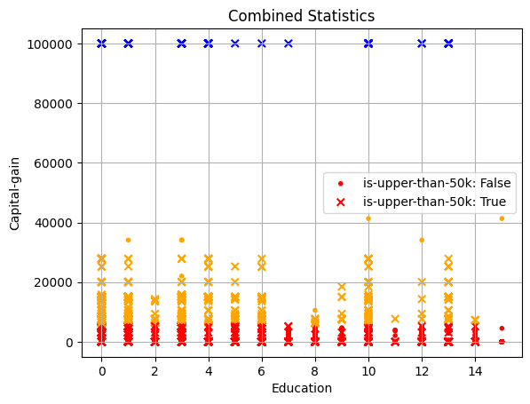
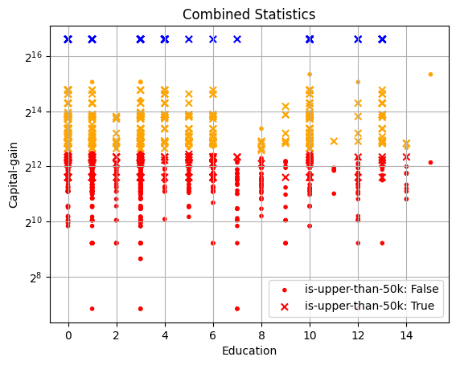
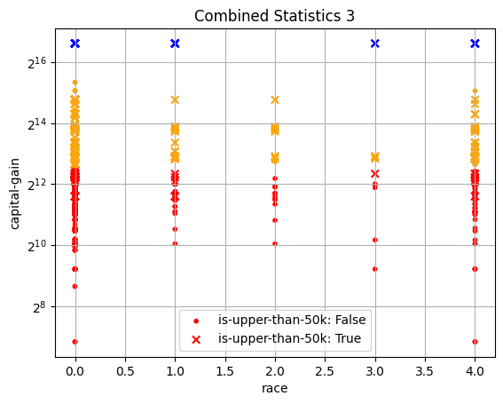
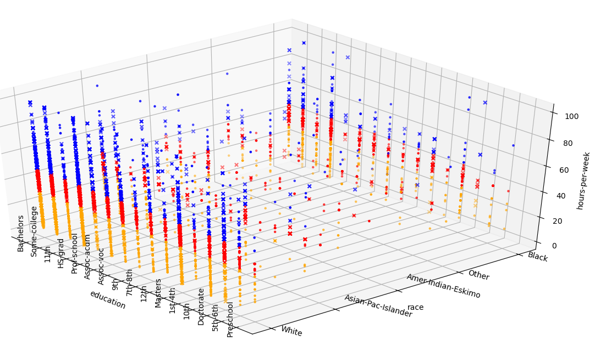
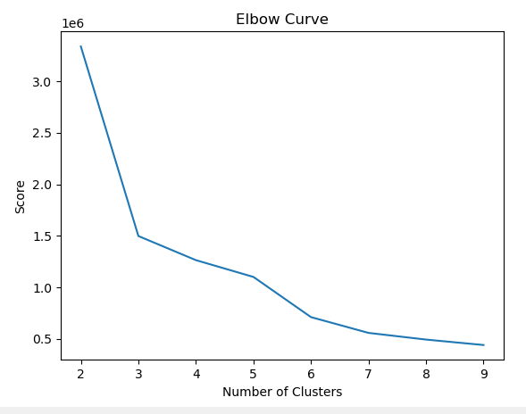

#pysparkPower
<p align="center">
  <a href="https://kirgizov.link/teaching/esirem/bigdata-2021/examples/iris-spark.py" target="blank"></a>
</p>

***
[](https://pypi.python.org/pypi/sysbus)
[](https://pypi.python.org/pypi/sysbus)
[](https://github.com/rene-d/sysbus/blob/master/LICENSE)
##Description
###Under the supervision of:
- Sergey KIRGIZOV

###Grade:
- 2021/2022

###Produced by:
- Julien BOULLY
- Youssef TALEB

##Introduction:
In this big data project, we will learn about clustering techniques via Apache Spark. We used the Python programming language and the git version manager as well as the Github servers.
You can find the repos at this address: https://github.com/omegaBionic/pysparkPower.git

###Dataset:
- "Recensement, 48 842 instances "http://archive.ics.uci.edu/ml/datasets/Adult"

###tree structure
```bach
└──╼ $tree
.
├── data
│   ├── adult.data
│   ├── adult.names
│   ├── adult_processed_data.data
│   ├── adult.test
│   ├── Dictionaries.txt
│   ├── old.adult.names
│   ├── process_initial_file.py
│   └── __pycache__
│       └── process_initial_file.cpython-39.pyc
├── LICENSE
├── main.py
├── README.md
└── Resources
    ├── figure_capital-gain_education_is-upper-50k_with-log2.png
    ├── figure_capital-gain_education_is-upper-50k_without-log2.png
    └── figure_race_capital-gain_is-upper-50k.png
```
***

###Presentation of the chosen dataset:
- During this project we had the choice between 10 datasets, we chose the one called: "Census, 48 842 instances".

- During this project, we based ourselves on this code:
https://kirgizov.link/teaching/esirem/bigdata-2021/examples/iris-spark.py

- And the instructions were given in this document:
https://kirgizov.link/teaching/esirem/bigdata-2021/TP-PROJET.pdf

---

#Datas
##Data 1 : Capital gain + Education + < ou >= 50k earned per year -> without log(2)


##Data 2 : Capital gain + Education + < ou >= 50k earned per year -> with log(2)


##For data 1 and data 2 we can notice:
###Legend :
- 0: Bachelors
- 1: Some-college
- 2: 11th
- 3: HS-grad
- 4: Prof-school
- 5: Assoc-acdm
- 6: Assoc-voc
- 7: 9th
- 8: 7th-8th
- 9: 12th
- 10: Masters
- 11: 1st-4th
- 12: 10th
- 13: Doctorate
- 14: 5th-6th
- 15: Preschool

###Data 1 and data 2:
- In Y we have the capital, in X the level of education and cross is that they earn more than 50k and point is less than 50k.
- That the blue cluster represents the richest, the orange the people who earn a lot of money in red the less rich.
- In blue the richest people all earn more than 50k.
- Notice that the majority of people are in the lower middle and the richest represent a very small portion: red cluster⇾310992, orange cluster⇾1303, blue cluster⇾159.
- The rich represent 0.05% of the population in our data.
- On the log(2) graph we can see that there are few people who have almost nothing in capital and this makes for a more homogeneous graph for reading.

---

###Data 3 : Capital gain + Education + < ou >= 50k earned per year -> with log(2)


###For data 3:
###Legend:
- 0: White
- 1: Asian-Pac-Islander
- 2: Amer-Indian-Eskimo
- 3: Other
- 4: Black

###Data 3:
- Il n'y a pas de Amer-Indian-Eskimo riches selon le cluster bleu

---

##Data 4 : education_race_hours_per_week


---
##Method to find the proper number of clusters
